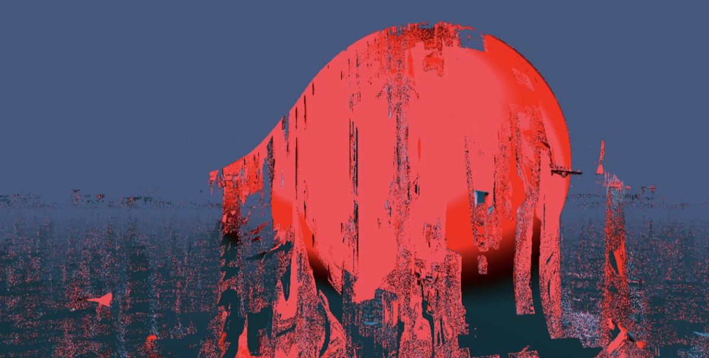

# RAIVE 2026 Projects

Projects under development for the [RAIVE AI Summer School](https://raive.school),
August 31 – September 6, 2026, at the Royal Conservatoire Antwerp.

## About the school

RAIVE is a laboratory for young artists from dance, music, technology and visual
arts. Participants build their own AI systems from first principles and create
and curate their own datasets. The approach is hands-on and artistic, not
theoretical.

Participants work in groups for a week, guided by three coaches from different
fields. The coaches mentor the groups and share their own artistic practice
through lectures and performances. Introductory workshops cover AI, interactive
audio and performance practice.

The week ends with a public presentation in De Gele Zaal of the Royal
Conservatoire Antwerp. The presentation shows the raw results of a week of
exploration, not polished pieces.

## Projects

| Project | What it is |
| --- | --- |
| [`fruit-drama`](fruit-drama/) | Realtime fruit-drama characters driven by a webcam. Wan 2.2 video generation, pose conditioning and a pix2pix model that runs live in Figment. |
