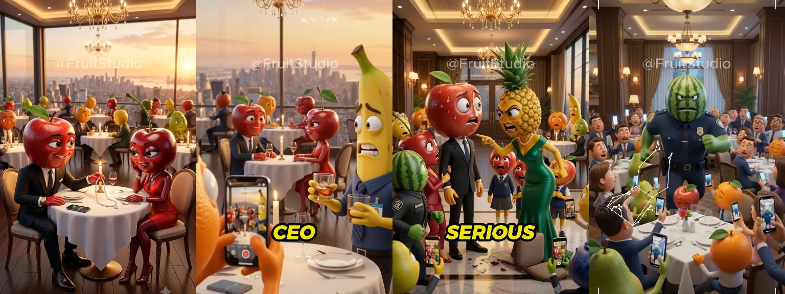
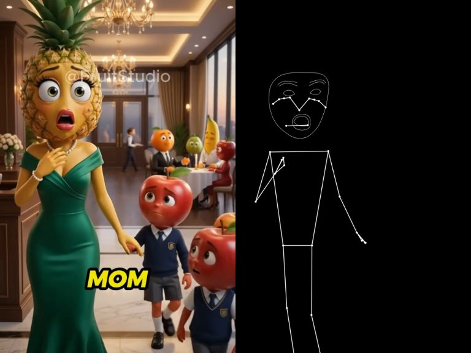
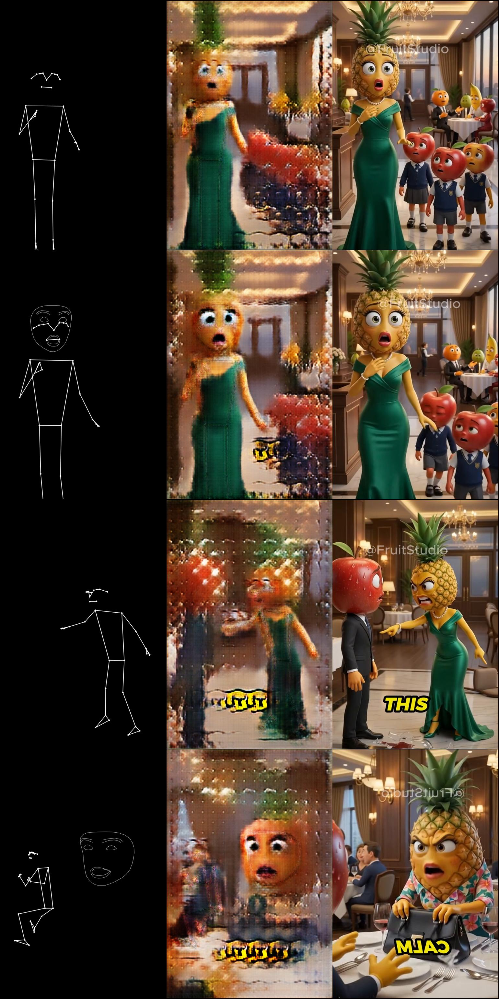
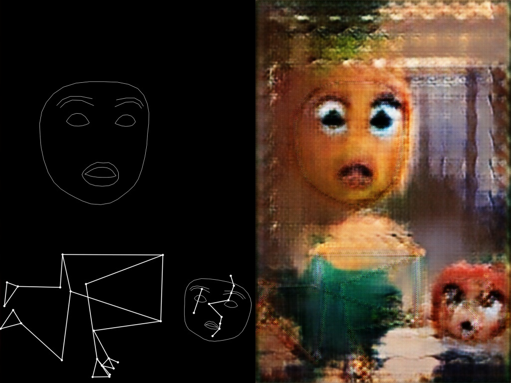
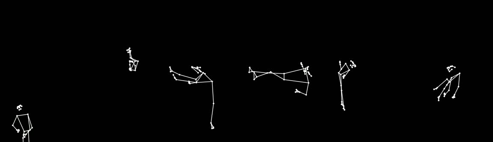

# Diary

Working log for the fruit-drama project. Newest entry at the bottom.
Screenshots live in `diary/`.

## 2026-09-01 11:00 — Kick-off

- Read the reference blog post. Fruit drama = offline pipeline, small motion,
  Pixar-meets-telenovela look.
- Probed the 4090 box: RTX 4090 24 GB, CUDA 12.8, 62 GB RAM, `uv`, `ffmpeg`.
- Wrote `CLAUDE.md`, `STRATEGY.md` (two tracks), `prompts.md`.
- Found `train.fgmt`: Load Movie → Detect Pose (heavy, 2) + Detect Faces (2) →
  lighten → Stack → Save. 829 frames exported from `fruit-drama-apple-ceo.webm`
  (1080×1920, 30 fps).
- Read Figment's `detectPose.js` and `detectFaces.js`. Drawing defaults:
  pose points r=2, lines w=2, white on black; face contours w=1 white.
- MediaPipe Holistic: still exists in the Python Tasks API, not in the web
  Tasks API. Figment uses pose + face separately. Python does the same.
- Model choice for data generation: `yetter-ai/Wan2.2-TI2V-5B-Turbo-Diffusers`,
  4 steps, 1280×704, 121 frames at 24 fps. Supports image-to-video. Download
  started on the box.

Observation: in the exported frame `export/image-00100.jpg` Figment found a
partial skeleton and **no face** on either apple. The pineapple screenshot shows
face detection can work on fruit heads. Detection rate is the first thing to
measure.

## 2026-09-01 11:30 — Infrastructure

- Committed and pushed the scaffold (`7930dd4`): `STRATEGY.md`, `prompts.md`,
  `scripts/render_conditioning.py`, `scripts/generate_clips.py`,
  `scripts/train_pix2pix.py`, `pyproject.toml`.
- `scripts/render_conditioning.py` reproduces the Figment drawing: pose points
  r=2 with the DrawingUtils default 4 px stroke (effective r≈4), lines w=2, face
  contours w=1, lighten composite, `[target | input]` stack.
- `scripts/train_pix2pix.py` is the CCM notebook as a CLI. Same architecture,
  same losses. ONNX export uses the dataset's own width × height, so portrait
  pairs work.
- **The box's internet is slow: ~1–5 MB/s.** The Wan Turbo model is ~22 GB and
  `uv sync` pulls ~5 GB of torch + CUDA. Expect 1–2 hours before the first
  clip. Started both, plus a MediaPipe-only env to test detection on
  `fruit-drama-apple-ceo.webm` in the meantime.
- Lesson: never put the string `hf download` in an ssh command line that also
  runs `pkill -f`. It kills its own shell. Use `scripts/box/restart_download.sh`.
- `.gitignore`: `export/`, `*.webm`, `.venv/`. The 829 exported frames (242 MB)
  and the source video are synced to the box with rsync, not git.

## 2026-09-01 11:45 — Resolution decision

The pix2pix U-Net has 8 down-samplings, so width and height must divide by
256. Portrait options: 512×768, 512×1024, 768×1280.

- Generate at **768×1280** (aspect 0.60, close to 9:16). Wan needs multiples
  of 32; this fits.
- Train at **512×768** per half. Inference cost in Figment scales with pixels;
  512×768 is 3.75× cheaper than 768×1280. That is where "realtime" is won.
- `render_conditioning.py --size 512x768` center-crops to 2:3 *before*
  detection, then resizes. No squash, and landmark coordinates stay aligned.
- The same crop + resize must happen in Figment at inference. Add a Crop node
  before Detect Pose / Detect Faces.

## 2026-09-01 12:05 — Why it is slow

- The box is on **Wi-Fi** (`wlp5s0`). The Ethernet port `enp6s0` has no
  carrier. Total inbound is ~3 MB/s. A cable would fix this.
- The uv cache on the box already holds torch 2.8.0 (PyPI build, CUDA 12.8
  bundled). My first `pyproject.toml` asked for the newest cu128 build
  (2.11.0), which would download ~4 GB again. Pinned `torch==2.8.0`,
  `torchvision==0.23.0`, dropped the custom index, restarted `uv sync`.
- OpenCV cannot decode the AV1 webm. Transcoded to H.264 with ffmpeg
  (`media/apple_ceo.mp4`, 1645 frames). Detection test restarted on that file,
  every 3rd frame, at 512×768.
- Diary is also published as a phone-readable page:
  https://claude.ai/code/artifact/d0a973f2-34c6-4124-b07f-a2667a01c219

## 2026-09-01 12:30 — First detection results on the apple-CEO video



Three of the four sampled frames have **no detection at all**. The video is a
compilation of crowded group shots: seated characters, backs turned, huge
fruit heads, phones in the foreground. MediaPipe was trained on humans and
gives up.



The pineapple "MOM" scene works: one character, frontal, full body, face
found. This is the shape every training frame needs.

Consequences:
- Train only on frames with a pose (`--skip-empty`). The renderer now writes a
  per-frame CSV (`poses,faces` per frame) so we can curate.
- Generated clips must be **single character, frontal, full body, medium or
  wide shot**. Two people at a table will not detect.
- Saved the pineapple frame as `media/refs/pineapple_mom.png` (768×1280). It is
  a known-good image-to-video reference.
- Environment is ready (torch 2.8 + CUDA, diffusers 0.40, MediaPipe 1.0.1).
  Detection runs at ~20 fps on CPU.
- Started pix2pix training on the apple-CEO pairs while the Wan model
  downloads. This validates the whole chain end to end.

## 2026-09-01 13:00 — Download stalled; Wi-Fi is not the whole story

- Correction to the earlier note: `iwconfig` shows the Wi-Fi link at 400 Mb/s,
  signal −51 dBm, quality 59/70. The radio is fine. The ~3 MB/s ceiling is
  upstream of the box (router or ISP). A cable may not change it.
- The HF download process died once and, after restart, wrote 0 bytes for
  minutes while holding three `.incomplete` blobs open. The client uses the
  Xet chunk protocol (`~/.cache/huggingface/xet/logs`). Restarted with
  `HF_HUB_DISABLE_XET=1` to force plain HTTPS from the CDN.
- Meanwhile: training on the 603 apple-CEO pairs continues (~12 s/epoch).
  Wrote `scripts/check_onnx.py` (runs the exported ONNX with onnxruntime,
  prints the input shape Figment will read) and `inference.fgmt` (webcam →
  crop 2:3 → resize 512×768 → pose + face → lighten → ONNX → out).

## 2026-09-01 13:20 — pix2pix learns the pineapple



At epoch 40 the generator draws a pineapple woman in a green gown from a
skeleton. When the face contour is present it renders eyes and an open
mouth. Rows 3–4 (other scenes, partial skeletons) stay mushy: too few
examples per scene.



`generator_epoch_40.onnx` loads in onnxruntime. Input `[batch, 3, 768, 512]`
float32, output the same. That is what Figment's ONNX Image Model node reads.
File size 218 MB (fp32). 400 ms on CPU; WebGPU in Figment will be far faster.

- Xet fix confirmed: download now runs at 3.3 MB/s. ETA for the model
  ~14:45.
- `scripts/box/pipeline_after_generation.sh` waits for the clips, renders
  conditioning for every generated clip, builds `media/dataset_pineapple`, and
  trains a second model. No hands needed.

## 2026-09-01 13:40 — Lost SSH to the box

- `ssh codespace@100.91.215.104` now fails with `Permission denied (publickey)`.
  Cause: the 1Password SSH agent socket on the Mac is gone (1Password locked
  while nobody is at the machine). The box only accepts the 1Password-held key.
  Tailscale SSH is not enabled on the box. The Tailscale route is via the
  "ams" relay, which also explains the slow rsync earlier.
- Nothing on the box depends on me. Still running there:
  - model download (no Xet, 3.3 MB/s, ETA ~14:45)
  - `scripts/box/generate_when_ready.sh` → runs the three job lists when the
    model is complete and the GPU is free
  - pix2pix training on the apple-CEO pairs (60 epochs, ONNX every 5)
- **Not started:** `scripts/box/pipeline_after_generation.sh` (the scp failed
  when the key vanished). When SSH is back, or by hand:
  ```
  ssh codespace@100.91.215.104
  cd ~/Work/2026-raive-projects/fruit-drama
  setsid nohup bash scripts/box/pipeline_after_generation.sh > media/pipeline_after_generation.log 2>&1 &
  ```
- A watcher on the Mac retries SSH every minute and resumes automatically.

## 2026-09-01 12:25 (box time) — SSH back, first model finished

Note on clocks: earlier entries used my estimate; the box clock is CEST and
about an hour behind those labels. From here on, box time.

- SSH works again (1Password unlocked).
- Apple-CEO training finished: 60 epochs, 12 ONNX snapshots,
  `media/train_apple_ceo/generator_epoch_60.onnx`.
- Model download at 9.8 GB of ~22 GB, 3 MB/s. ETA about 65 minutes.
- `pipeline_after_generation.sh` is now running and waiting for the clips.
  The full chain is armed: download → generate 16 clips → conditioning →
  `dataset_pineapple` → train 100 epochs → ONNX.

## 2026-09-01 12:45 (box time) — GPU busy, scenes, skeleton-first plan

- **pix2pixHD** (`scripts/train_pix2pixhd.py`, from the repo notebook: ResNet
  global generator, two-scale PatchGAN, feature matching + VGG loss) trains on
  the 603 apple-CEO pairs while the download finishes. 2.3 it/s at batch 4,
  13.5 GB VRAM, 60 epochs ≈ 65 min. ONNX every 10 epochs, opset 17. Expect
  sharper output than the U-Net; expect lower fps in Figment (heavier model).
- **Scene code in the conditioning.** The background color of the
  conditioning image now encodes the scene (`scenes.json`, one dark hue per
  scene). Figment's Detect Pose and Detect Faces both have a `background`
  parameter, so at inference the student picks the scene by picking the color.
  One model, twelve scenes.
- **Twelve new scenes** in `scenes.json`: character × setting × emotion, all
  single character, frontal, full body. `make_jobs.py t2v` makes one reference
  clip per scene; `make_jobs.py i2v` takes each reference clip's first frame
  and makes four motion clips per scene. ~60 clips, ~7000 frames.
- **Skeleton first** (`scripts/generate_vace.py`): Wan 2.1 VACE 1.3B takes our
  skeleton video as control plus a reference image. Motion follows the
  skeleton exactly, so pairs need no detection (`process_with_landmarks`).
  `make_control_clips.py` cuts 81-frame control clips out of any
  `landmarks.jsonl`. The download (3.5 GB, text encoder shared with Turbo)
  starts by itself when the Turbo download ends.
- Mac download speed: 6.5 MB/s, 2× the box. Turbo is past halfway on the box,
  VACE is small. USB only pays off for 14B-class models.
- Workflow is git now: write here → push → `git pull` on the box →
  `scripts/box/restart_waiters.sh`.

## 2026-09-01 12:55 (box time) — Control clips for VACE

- First cut gave **0** control clips: the longest unbroken pose run in the
  compilation is 70 frames; VACE needs 81. Scenes cut every 2–3 s and
  detection drops out in between.
- `make_control_clips.py` now bridges detection gaps ≤ 6 frames by
  interpolating landmarks, and extends runs of 41–80 frames by ping-pong
  (forward, then back: a gesture and its return). Result: runs of 252, 54, 54,
  50, 40 … frames → **6 control clips** of 81 frames in `media/control/`.
- Real webcam driving videos from students will give hundreds of these.
  The 6 are enough to test whether VACE follows our skeleton style.



The strip settles it: skeletons detected on fruit footage are not usable as
guidance. Tiny, mangled, sometimes a background human, sometimes sideways.
Removed the cartoon control clips; the VACE step now waits for human driving
videos in `media/driving/` (`scripts/box/driving_to_control.sh`).
