# Diary

Working log for the fruit-drama project. Newest entry at the bottom.
Screenshots live in `diary/`.

## 2026-09-01 11:00 — Kick-off

- Read the reference blog post. Fruit drama = offline pipeline, small motion,
  Pixar-meets-telenovela look.
- Probed the 4090 box: RTX 4090 24 GB, CUDA 12.8, 62 GB RAM, `uv`, `ffmpeg`.
- Wrote `CLAUDE.md`, `STRATEGY.md` (two tracks), `prompts.md`.
- Found `train.fgmt`: Load Movie → Detect Pose (heavy, 2) + Detect Faces (2) →
  lighten → Stack → Save. 829 frames exported from `fruit-drama-apple-ceo.webm`
  (1080×1920, 30 fps).
- Read Figment's `detectPose.js` and `detectFaces.js`. Drawing defaults:
  pose points r=2, lines w=2, white on black; face contours w=1 white.
- MediaPipe Holistic: still exists in the Python Tasks API, not in the web
  Tasks API. Figment uses pose + face separately. Python does the same.
- Model choice for data generation: `yetter-ai/Wan2.2-TI2V-5B-Turbo-Diffusers`,
  4 steps, 1280×704, 121 frames at 24 fps. Supports image-to-video. Download
  started on the box.

Observation: in the exported frame `export/image-00100.jpg` Figment found a
partial skeleton and **no face** on either apple. The pineapple screenshot shows
face detection can work on fruit heads. Detection rate is the first thing to
measure.

## 2026-09-01 11:30 — Infrastructure

- Committed and pushed the scaffold (`7930dd4`): `STRATEGY.md`, `prompts.md`,
  `scripts/render_conditioning.py`, `scripts/generate_clips.py`,
  `scripts/train_pix2pix.py`, `pyproject.toml`.
- `scripts/render_conditioning.py` reproduces the Figment drawing: pose points
  r=2 with the DrawingUtils default 4 px stroke (effective r≈4), lines w=2, face
  contours w=1, lighten composite, `[target | input]` stack.
- `scripts/train_pix2pix.py` is the CCM notebook as a CLI. Same architecture,
  same losses. ONNX export uses the dataset's own width × height, so portrait
  pairs work.
- **The box's internet is slow: ~1–5 MB/s.** The Wan Turbo model is ~22 GB and
  `uv sync` pulls ~5 GB of torch + CUDA. Expect 1–2 hours before the first
  clip. Started both, plus a MediaPipe-only env to test detection on
  `fruit-drama-apple-ceo.webm` in the meantime.
- Lesson: never put the string `hf download` in an ssh command line that also
  runs `pkill -f`. It kills its own shell. Use `scripts/box/restart_download.sh`.
- `.gitignore`: `export/`, `*.webm`, `.venv/`. The 829 exported frames (242 MB)
  and the source video are synced to the box with rsync, not git.

## 2026-09-01 11:45 — Resolution decision

The pix2pix U-Net has 8 down-samplings, so width and height must divide by
256. Portrait options: 512×768, 512×1024, 768×1280.

- Generate at **768×1280** (aspect 0.60, close to 9:16). Wan needs multiples
  of 32; this fits.
- Train at **512×768** per half. Inference cost in Figment scales with pixels;
  512×768 is 3.75× cheaper than 768×1280. That is where "realtime" is won.
- `render_conditioning.py --size 512x768` center-crops to 2:3 *before*
  detection, then resizes. No squash, and landmark coordinates stay aligned.
- The same crop + resize must happen in Figment at inference. Add a Crop node
  before Detect Pose / Detect Faces.

## 2026-09-01 12:05 — Why it is slow

- The box is on **Wi-Fi** (`wlp5s0`). The Ethernet port `enp6s0` has no
  carrier. Total inbound is ~3 MB/s. A cable would fix this.
- The uv cache on the box already holds torch 2.8.0 (PyPI build, CUDA 12.8
  bundled). My first `pyproject.toml` asked for the newest cu128 build
  (2.11.0), which would download ~4 GB again. Pinned `torch==2.8.0`,
  `torchvision==0.23.0`, dropped the custom index, restarted `uv sync`.
- OpenCV cannot decode the AV1 webm. Transcoded to H.264 with ffmpeg
  (`media/apple_ceo.mp4`, 1645 frames). Detection test restarted on that file,
  every 3rd frame, at 512×768.
- Diary is also published as a phone-readable page:
  https://claude.ai/code/artifact/d0a973f2-34c6-4124-b07f-a2667a01c219

## 2026-09-01 12:30 — First detection results on the apple-CEO video


Three of the four sampled frames have **no detection at all**. The video is a
compilation of crowded group shots: seated characters, backs turned, huge
fruit heads, phones in the foreground. MediaPipe was trained on humans and
gives up.


The pineapple "MOM" scene works: one character, frontal, full body, face
found. This is the shape every training frame needs.

Consequences:
- Train only on frames with a pose (`--skip-empty`). The renderer now writes a
  per-frame CSV (`poses,faces` per frame) so we can curate.
- Generated clips must be **single character, frontal, full body, medium or
  wide shot**. Two people at a table will not detect.
- Saved the pineapple frame as `media/refs/pineapple_mom.png` (768×1280). It is
  a known-good image-to-video reference.
- Environment is ready (torch 2.8 + CUDA, diffusers 0.40, MediaPipe 1.0.1).
  Detection runs at ~20 fps on CPU.
- Started pix2pix training on the apple-CEO pairs while the Wan model
  downloads. This validates the whole chain end to end.

## 2026-09-01 13:00 — Download stalled; Wi-Fi is not the whole story

- Correction to the earlier note: `iwconfig` shows the Wi-Fi link at 400 Mb/s,
  signal −51 dBm, quality 59/70. The radio is fine. The ~3 MB/s ceiling is
  upstream of the box (router or ISP). A cable may not change it.
- The HF download process died once and, after restart, wrote 0 bytes for
  minutes while holding three `.incomplete` blobs open. The client uses the
  Xet chunk protocol (`~/.cache/huggingface/xet/logs`). Restarted with
  `HF_HUB_DISABLE_XET=1` to force plain HTTPS from the CDN.
- Meanwhile: training on the 603 apple-CEO pairs continues (~12 s/epoch).
  Wrote `scripts/check_onnx.py` (runs the exported ONNX with onnxruntime,
  prints the input shape Figment will read) and `inference.fgmt` (webcam →
  crop 2:3 → resize 512×768 → pose + face → lighten → ONNX → out).

## 2026-09-01 13:20 — pix2pix learns the pineapple


At epoch 40 the generator draws a pineapple woman in a green gown from a
skeleton. When the face contour is present it renders eyes and an open
mouth. Rows 3–4 (other scenes, partial skeletons) stay mushy: too few
examples per scene.


`generator_epoch_40.onnx` loads in onnxruntime. Input `[batch, 3, 768, 512]`
float32, output the same. That is what Figment's ONNX Image Model node reads.
File size 218 MB (fp32). 400 ms on CPU; WebGPU in Figment will be far faster.

- Xet fix confirmed: download now runs at 3.3 MB/s. ETA for the model
  ~14:45.
- `scripts/box/pipeline_after_generation.sh` waits for the clips, renders
  conditioning for every generated clip, builds `media/dataset_pineapple`, and
  trains a second model. No hands needed.

## 2026-09-01 13:40 — Lost SSH to the box

- `ssh codespace@100.91.215.104` now fails with `Permission denied (publickey)`.
  Cause: the 1Password SSH agent socket on the Mac is gone (1Password locked
  while nobody is at the machine). The box only accepts the 1Password-held key.
  Tailscale SSH is not enabled on the box. The Tailscale route is via the
  "ams" relay, which also explains the slow rsync earlier.
- Nothing on the box depends on me. Still running there:
  - model download (no Xet, 3.3 MB/s, ETA ~14:45)
  - `scripts/box/generate_when_ready.sh` → runs the three job lists when the
    model is complete and the GPU is free
  - pix2pix training on the apple-CEO pairs (60 epochs, ONNX every 5)
- **Not started:** `scripts/box/pipeline_after_generation.sh` (the scp failed
  when the key vanished). When SSH is back, or by hand:
  ```
  ssh codespace@100.91.215.104
  cd ~/Work/2026-raive-projects/fruit-drama
  setsid nohup bash scripts/box/pipeline_after_generation.sh > media/pipeline_after_generation.log 2>&1 &
  ```
- A watcher on the Mac retries SSH every minute and resumes automatically.

## 2026-09-01 12:25 (box time) — SSH back, first model finished

Note on clocks: earlier entries used my estimate; the box clock is CEST and
about an hour behind those labels. From here on, box time.

- SSH works again (1Password unlocked).
- Apple-CEO training finished: 60 epochs, 12 ONNX snapshots,
  `media/train_apple_ceo/generator_epoch_60.onnx`.
- Model download at 9.8 GB of ~22 GB, 3 MB/s. ETA about 65 minutes.
- `pipeline_after_generation.sh` is now running and waiting for the clips.
  The full chain is armed: download → generate 16 clips → conditioning →
  `dataset_pineapple` → train 100 epochs → ONNX.

## 2026-09-01 12:45 (box time) — GPU busy, scenes, skeleton-first plan

- **pix2pixHD** (`scripts/train_pix2pixhd.py`, from the repo notebook: ResNet
  global generator, two-scale PatchGAN, feature matching + VGG loss) trains on
  the 603 apple-CEO pairs while the download finishes. 2.3 it/s at batch 4,
  13.5 GB VRAM, 60 epochs ≈ 65 min. ONNX every 10 epochs, opset 17. Expect
  sharper output than the U-Net; expect lower fps in Figment (heavier model).
- **Scene code in the conditioning.** The background color of the
  conditioning image now encodes the scene (`scenes.json`, one dark hue per
  scene). Figment's Detect Pose and Detect Faces both have a `background`
  parameter, so at inference the student picks the scene by picking the color.
  One model, twelve scenes.
- **Twelve new scenes** in `scenes.json`: character × setting × emotion, all
  single character, frontal, full body. `make_jobs.py t2v` makes one reference
  clip per scene; `make_jobs.py i2v` takes each reference clip's first frame
  and makes four motion clips per scene. ~60 clips, ~7000 frames.
- **Skeleton first** (`scripts/generate_vace.py`): Wan 2.1 VACE 1.3B takes our
  skeleton video as control plus a reference image. Motion follows the
  skeleton exactly, so pairs need no detection (`process_with_landmarks`).
  `make_control_clips.py` cuts 81-frame control clips out of any
  `landmarks.jsonl`. The download (3.5 GB, text encoder shared with Turbo)
  starts by itself when the Turbo download ends.
- Mac download speed: 6.5 MB/s, 2× the box. Turbo is past halfway on the box,
  VACE is small. USB only pays off for 14B-class models.
- Workflow is git now: write here → push → `git pull` on the box →
  `scripts/box/restart_waiters.sh`.

## 2026-09-01 12:55 (box time) — Control clips for VACE

- First cut gave **0** control clips: the longest unbroken pose run in the
  compilation is 70 frames; VACE needs 81. Scenes cut every 2–3 s and
  detection drops out in between.
- `make_control_clips.py` now bridges detection gaps ≤ 6 frames by
  interpolating landmarks, and extends runs of 41–80 frames by ping-pong
  (forward, then back: a gesture and its return). Result: runs of 252, 54, 54,
  50, 40 … frames → **6 control clips** of 81 frames in `media/control/`.
- Real webcam driving videos from students will give hundreds of these.
  The 6 are enough to test whether VACE follows our skeleton style.


The strip settles it: skeletons detected on fruit footage are not usable as
guidance. Tiny, mangled, sometimes a background human, sometimes sideways.
Removed the cartoon control clips; the VACE step now waits for human driving
videos in `media/driving/` (`scripts/box/driving_to_control.sh`).

## 2026-09-01 13:00 (box time) — pix2pixHD ONNX: it loads, it is heavy

- `generator_epoch_10.onnx` loads in onnxruntime. Ops: Conv, ConvTranspose,
  InstanceNormalization, Pad (reflect), Relu, Tanh + shape plumbing. All
  supported by onnxruntime-web WebGPU.
- Size **730 MB** fp32 (U-Net: 218 MB). CPU inference 1257 ms (U-Net: 149 ms),
  so roughly 8× the compute. In Figment expect single-digit fps at 512×768
  where the U-Net does 30. Options if HD wins on quality: export fp16 (half the
  size), or `--n-blocks 6` / ngf 32 for a lighter generator. Decide after
  comparing samples at epoch 40–60.

## 2026-09-01 14:06 (Mac time) — Box offline

- Tailscale reports `codespace-4090 … offline, last seen 1m ago`. SSH times
  out. Not an auth problem this time: the box left the tailnet (Wi-Fi drop,
  suspend, or reboot).
- If only the network dropped: pix2pixHD training continues; the HF download
  process has probably died and needs `scripts/box/restart_download.sh`; the
  waiters are still waiting and are fine.
- If the box rebooted: everything stopped. Recovery when it is back:
  `bash scripts/box/restart_download.sh && bash scripts/box/restart_waiters.sh`,
  and `uv run scripts/train_pix2pixhd.py media/dataset_apple_ceo/pairs media/train_apple_ceo_hd --epochs 60 --batch-size 4 --snapshot-interval 10`
  resumes from the last snapshot.
- A watcher on the Mac retries SSH every minute.

## 2026-09-01 13:20 (RunPod time, UTC) — Second box: RunPod 4090

The Tailscale box stayed offline, so the Wan generation moved to a RunPod pod
(RTX 4090 24 GB, 12 vCPU, 31 GB RAM limit, 50 GB `/workspace` volume). Setup
notes in `CLAUDE.md`; one-shot bootstrap in `scripts/box/runpod_setup.sh`.

- The link is fast: Turbo (22 GB) and VACE (3.5 GB) downloaded in about two
  minutes with Xet. The `HF_HUB_DISABLE_XET=1` rule is for the Tailscale box.
- Trap 1: direct `sshd` sessions do not get the container env. `HF_HOME` was
  unset, so the models landed on the 30 GB ephemeral `/` (97 % full). Moved to
  `/workspace/.cache`; `/workspace/env.sh` sets the env for every session.
- Trap 2: the 31 GB cgroup limit. With `enable_model_cpu_offload` the text
  encoder (11 GB) and transformer (10 GB) sit in RAM: 23 GB RSS plus page
  cache hit the limit and the kernel killed the batch on the second clip, twice
  (`oom_kill 2` in `memory.oom_control`, no traceback in the log).
- Fix in `generate_clips.py`: encode all prompts of the batch first, free the
  text encoder, then run transformer + VAE on the GPU with no offload. RSS
  1.4 GB, VRAM peak 20 GB, and a clip takes **60 s instead of 109 s**. Also
  `--skip-existing` so a killed batch resumes.
- Note: with `guidance_scale=1.0` (Turbo, no CFG) the negative prompt has no
  effect. It stays in the script for a future model with CFG.
- Clip 1 (`pineapple_hallway_ref.mp4`) looks right: one character, full body,
  frontal, big gestures, marble hallway.

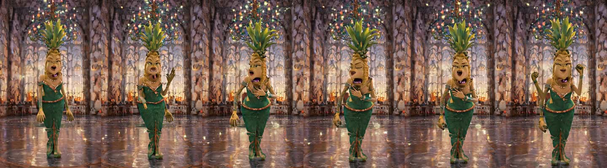

Running: the 12 reference clips, then 48 i2v motion clips (~50 min). Clips
rsync to the Mac's `media/clips/`. VACE waits for the human driving video.

## 2026-09-01 15:35 (box time) — Box back, HD finished, generation running

- The box had **rebooted** (uptime 1 min when SSH returned). pix2pixHD had
  already finished: 60 epochs, `media/train_apple_ceo_hd/generator_epoch_60.onnx`.
- The Turbo download was complete (`✓ Downloaded`, all shards present) but 16
  stale `.incomplete` blobs from the killed Xet attempts kept the waiters
  waiting. Deleted them. Generation started within a minute: 19.3 GB VRAM,
  first reference clip rendering.

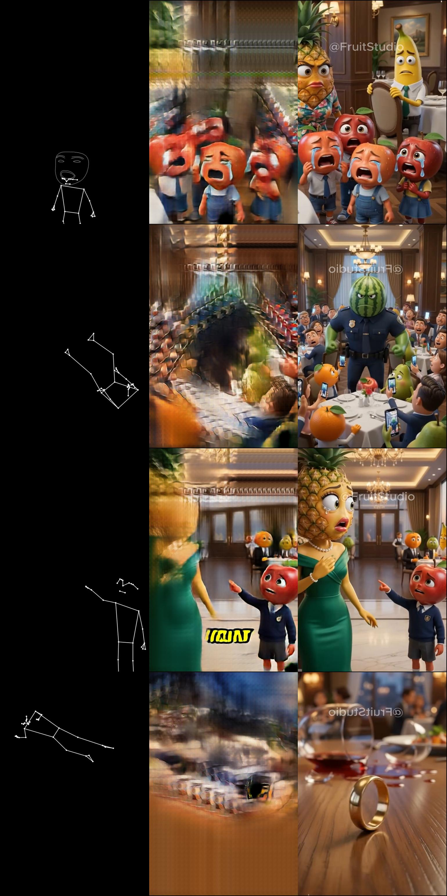

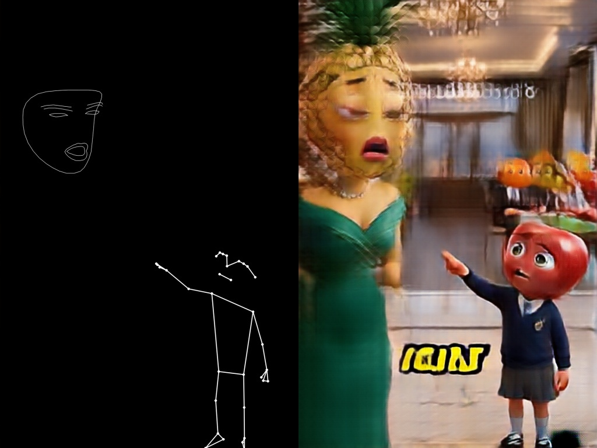

pix2pixHD at epoch 60 versus the U-Net at epoch 60: the crying apples are
individual characters, the pineapple + apple boy scene has readable faces and
a background. The U-Net gave smears there. ONNX inference 734 ms on CPU
(U-Net 149 ms). Quality wins by a wide margin; speed costs ~5×.

## 2026-09-01 15:45 (box time) — First generated scene


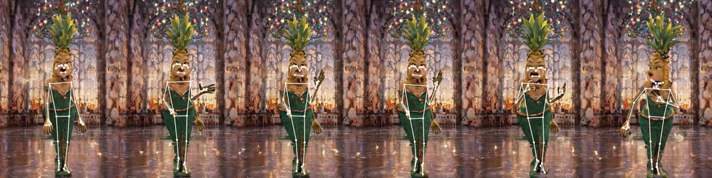

`pineapple_hallway_ref.mp4`: 768×1280, 121 frames, 77 s to generate. One
character, full body, frontal, gesturing, identity stable across the clip.
Pose found on 12 of 13 sampled frames and it lands on body, hands and feet.
Face contour: 0 of 13. The face landmarker does not accept a pineapple head.
The pose skeleton's own head points (eyes, nose, ears, mouth corners) still
give the model the head position and turn. Human driving videos through VACE
will add real face contours later.

## 2026-09-01 13:50 (RunPod time) — Confetti artefact: model, not script

Some Turbo clips (apple CEO office, avocado doctor) show colored fragments over
the whole frame, like lead-glass windows. Others (pineapple hallway, broccoli)
are clean. Suspect one: the new `generate_clips.py` (prompt embeddings computed
outside the pipeline). A/B on the same seed: old script vs new script give
pixel-identical clips, artefacts included. Not the script.

What it is: unconverged latents. The Wan VAE compresses 16× spatially, so one
noisy latent cell decodes to a ~16 px blob, the fragment size we see. Two
likely drivers for the 4-step Turbo: our 768×1280 is off the recommended
704×1280 grid, and 4 steps is thin for busy scenes. A sweep runs after VACE:
704×1280, 6 and 8 steps.

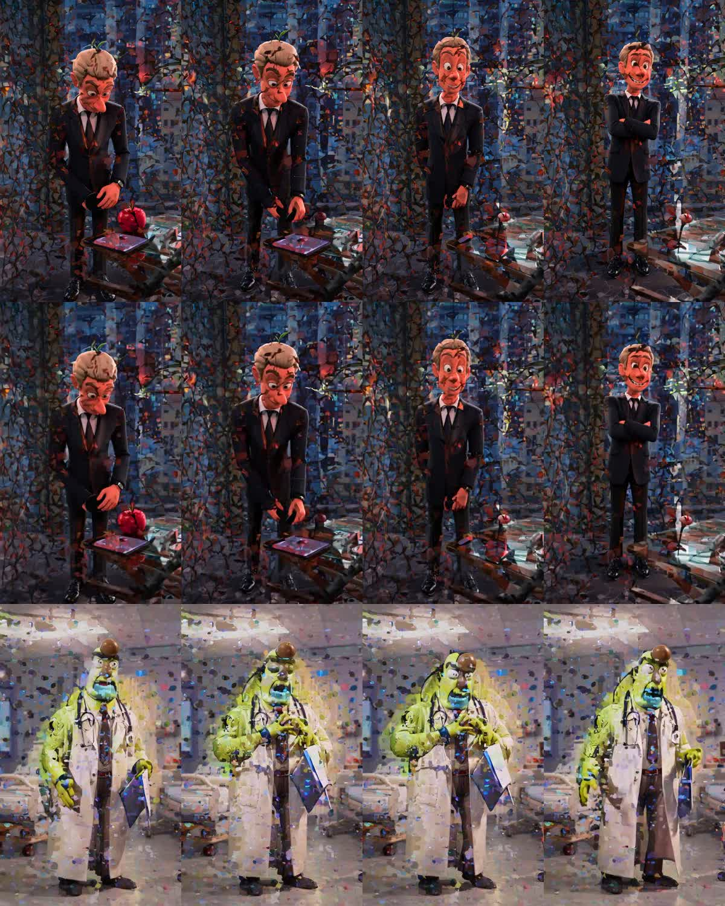

Also: the old script (CPU offload) dies on its second clip on the 31 GB box
every time (`oom_kill 3`). Control clips: 95 × 81 frames cut from the
`myrthe-ai-control` skeleton (23,106 frames at 50 fps, stride 3). First VACE
batch: 12 scenes × 1 control clip, ~5.5 min per clip with offload
(`--no-offload` runs out of VRAM in the fp32 VAE).

## 2026-09-01 15:50 (box time) — The roster: 12 reference scenes

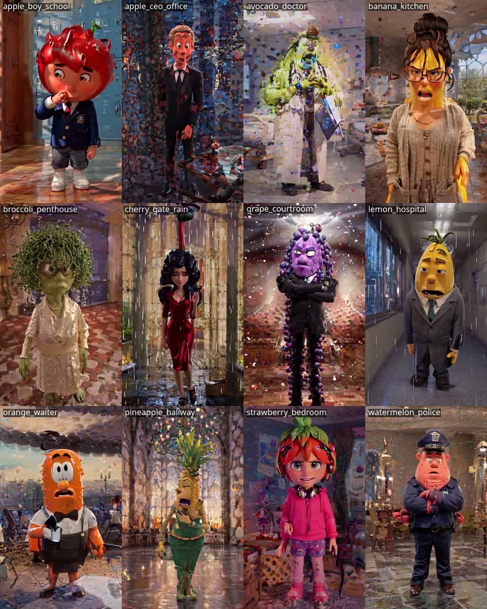

Detection on every 10th frame (13 frames per clip):

| scene | pose | face | look |
| --- | --- | --- | --- |
| apple_boy_school | 9 | 12 | clean |
| apple_ceo_office | 11 | 0 | **confetti**, character became a human with a leaf |
| avocado_doctor | 2 | 0 | **confetti**, pose lost in the white coat |
| banana_kitchen | 13 | 8 | clean |
| broccoli_penthouse | 10 | 0 | light speckle |
| cherry_gate_rain | 13 | 6 | clean (rain reads as rain) |
| grape_courtroom | 10 | 1 | sparkle overlay |
| lemon_hospital | 12 | 4 | clean |
| orange_waiter | 7 | 0 | sparkle overlay |
| pineapple_hallway | 12 | 0 | clean |
| strawberry_bedroom | 13 | 13 | clean, human-like face |
| watermelon_police | 13 | 3 | clean, faint sparkles behind |

Reading:
- 8 of 12 scenes are usable as they are. Pose detection works on generated
  fruit characters when the shot is single, frontal, full body.
- Face detection depends on how human the face is: strawberry 13/13, apple
  boy 12/13, pineapple 0/13.
- The **confetti** scenes share sparkle-heavy light words in the prompt
  (glass walls, city view, monitors, harsh overhead light, golden hour with
  candles) on top of the style suffix "glossy skin, cinematic lighting, high
  detail". With 4 steps and no CFG, a texture prior like that spreads over the
  whole frame. The RunPod clip with the same seed is pixel-identical, so this
  is prompt + seed, not hardware.
- A/B queued after the motion batch (`jobs_ab_apple_ceo.json`): new seed,
  reworded character, 6 steps, and a soft style suffix ("soft studio lighting,
  clean smooth render, simple background") for apple CEO and avocado.

## 2026-09-01 15:58 (box time) — Human skeleton data arrived

`skeletons/myrthe-ai-control_skeleton.jsonl`: 39,328 frames at 50 fps
(13 min), one person, Figment Detect Pose (heavy) export, 33 landmarks with
visibility, 1024×1024, pose only. Exactly what a student's live Figment
network emits, so training input and inference input match.

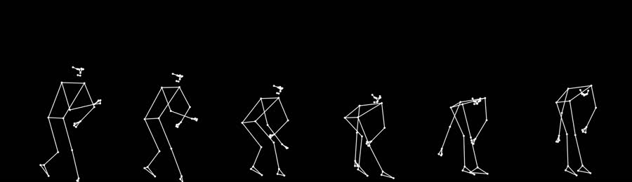

- `scripts/import_figment_skeleton.py` remaps the landmarks through a 2:3
  center crop (38,972 frames kept, 356 dropped for missing landmarks).
- `make_control_clips.py --stride 3` (50 → 16.7 fps) cut **160 control clips**
  of 81 frames into `media/control/`.
- The post-generation pipeline now runs VACE after the A/B: 2 control clips
  per scene (24 clips, ~1 h), reference image = each scene's first frame,
  exact pairs from the stored landmarks. Then pairs for everything, then
  pix2pix and pix2pixHD.
- The RunPod session has an uncommitted `make_control_clips.py` that reads the
  Figment format directly and renders OpenPose-style colored limbs (the format
  VACE was trained on). When it lands, OpenPose vs MediaPipe control style is
  the next A/B.

Timeline on the 4090: motion clips until ~16:45, A/B ~16:52, VACE until
~17:50, pairs + two trainings until ~19:30.

## 2026-09-01 14:00 (RunPod time) — Fragments come from the resolution

Sweep on the apple-CEO prompt, same seed: 768×1280 at 4, 6 and 8 steps all
keep the fragments; 704×1280 at 4 and at 8 steps are clean. The Turbo model
was distilled on the 704×1280 grid only. More steps do not repair an off-grid
size. `generate_clips.py` now defaults to 704×1280; the 768 clips moved to
`media/clips_768/` and every Turbo clip is regenerated (12 refs + 48 motion
clips, about 1 h).

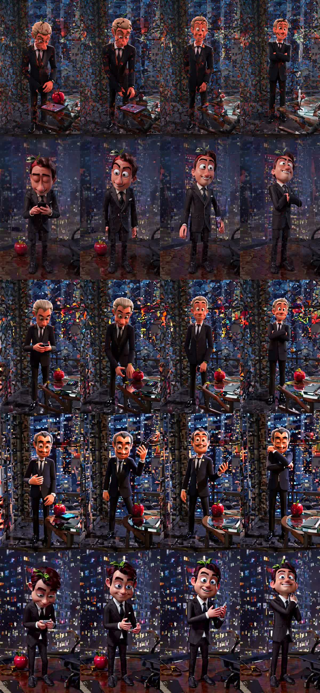

Consequence for pairs: 704×1280 is 0.55; the training size 512×768 is 0.667.
The 2:3 center-crop drops 8.75 % top and bottom. Prompts ask for head-to-feet
framing with margin, so most frames survive; `build_pairs.py` skips the rest.

VACE with our white MediaPipe lines: clean character, right scene, pose
ignored (arms stay down while the skeleton raises them; medium shot instead of
full body). `make_control_clips.py --style openpose` renders the OpenPose body
(18 joints, standard colors) from the same landmarks. Test running.

## 2026-09-01 14:20 (RunPod time) — VACE ignores our skeletons

Same control clip (`myrthe_000`, 81 frames), pineapple-hallway reference,
four runs. In every one the character stands with the arms down while the
skeleton raises an arm and lifts a knee. Framing stays a medium shot.

| Control render | Reference | `conditioning_scale` | Follows pose |
| --- | --- | --- | --- |
| MediaPipe white lines | yes | 1.0 | no |
| OpenPose colors (18 joints from MediaPipe) | yes | 1.0 | no |
| OpenPose colors | no | 1.0 | no (identity lost: a human woman) |
| OpenPose colors | yes | 1.5 | no, oversaturated |

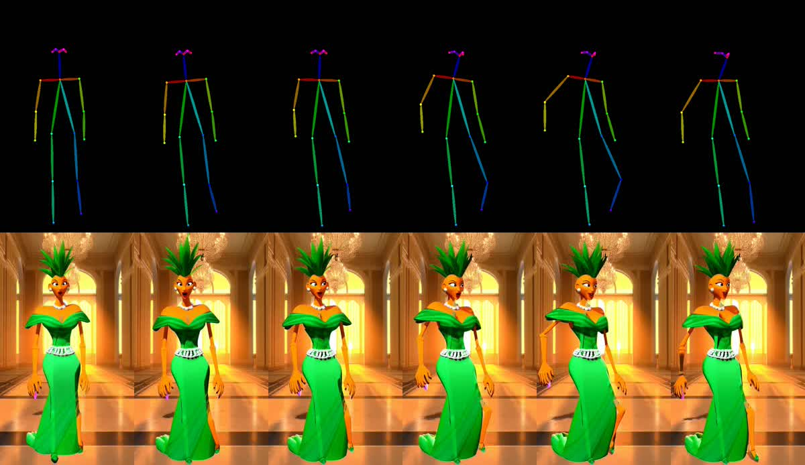

The diffusers docs confirm the call (`video=` control frames, `reference_images=`,
no mask) is the canonical pose task, so the plumbing is right. Open question:
does VACE read our synthetic drawing as a pose at all? Test: run the real
OpenPose detector (`controlnet_aux`, body + hands + face) on the original
human video (`scripts/video_to_openpose.py`, 1024×1024 at 50 fps, 39,328
frames) and feed that. If this follows the pose, the gap is our render. If not,
VACE 1.3B is the wrong tool here; Wan 2.2 Animate (14B, character image +
pose video, needs a bigger GPU) is the next candidate.

## 2026-09-01 14:30 (RunPod time) — VACE follows the OpenPose detector drawing

`controlnet_aux.OpenposeDetector` (body + hands + face) on 81 frames of the
original human video (`media/driving/myrthe-ai-control.mp4`, 1024×1024,
50 fps, stride 3), same reference image and prompt: the pineapple woman dances
with the skeleton, arm up, lean, leg lift, frame by frame.

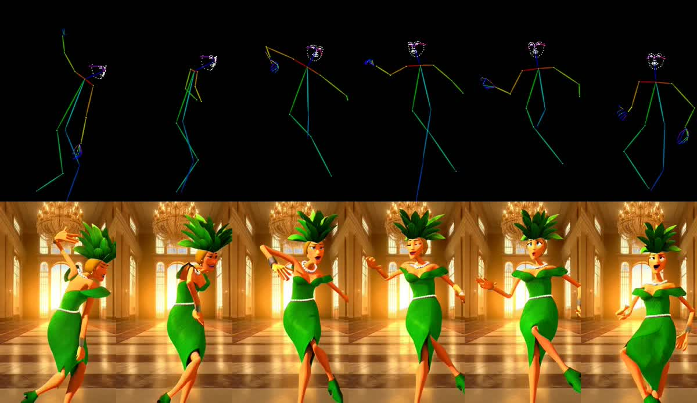

So VACE wants the detector's own drawing. Our renders from MediaPipe landmarks
(white lines, or OpenPose colors) it does not read as a pose. Pipeline now:

- `make_control_clips.py` cuts the MediaPipe landmark clips (for the pairs).
- `video_to_openpose.py --landmarks <clip>.landmarks.jsonl` renders the
  OpenPose control for exactly those source frames (`media/control_dw/`).
- `make_jobs.py vace` pairs each scene with a `control_dw` clip and the
  matching `control` landmarks. `build_pairs.py` is unchanged.
- `driving_to_control.sh` runs all of it.

Cost: the detector takes about 4 min per 81-frame clip (hands + face,
mostly CPU). `--no-hand-face` is the lever if that matters; test whether the
face dots help the fruit faces first. Running: OpenPose renders for 12 control
clips, then one VACE clip per scene (~1 h GPU) after the 704 regeneration.

## 2026-09-01 17:00 (box time) — A/B on the confetti scene

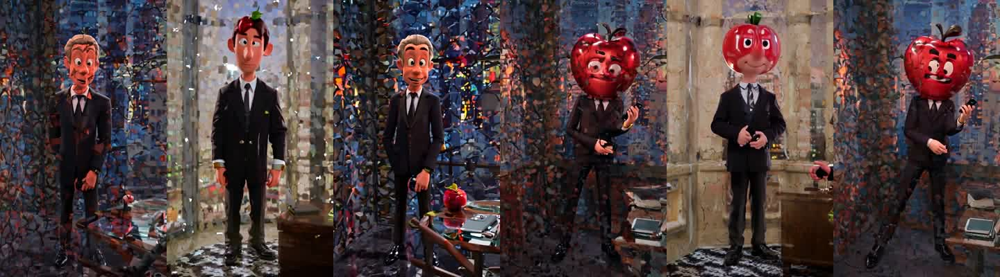

Left to right: original · seed 103 · 6 steps · reworded · reworded + seed 103 ·
reworded + soft style.

- Rewording fixes the character: "a man whose head is a big shiny red apple
  with eyes and a mouth" gives an apple head every time. "a red apple man"
  gave a human three times out of three.
- The confetti is seed- and prompt-driven, not step-driven: 6 steps changed
  nothing; seed 103 is cleaner than 102 in every pairing. Reworded + seed 103
  is the cleanest, with a residual mosaic in the background. The soft style
  suffix cleans the character, not the office background.
- Recipe for the four bad scenes: explicit "head is a big X" phrasing, a
  plainer background (no glass walls, city view, harsh lights), and 2–3 seeds
  per scene with an automatic speckle score to pick the reference.
- Generation done: 12 references + 48 motion + 8 pineapple-video = 68 clips
  in ~80 min. VACE model complete since 16:14. Pipeline continues: 24 VACE
  clips, pairs, pix2pix, pix2pixHD.

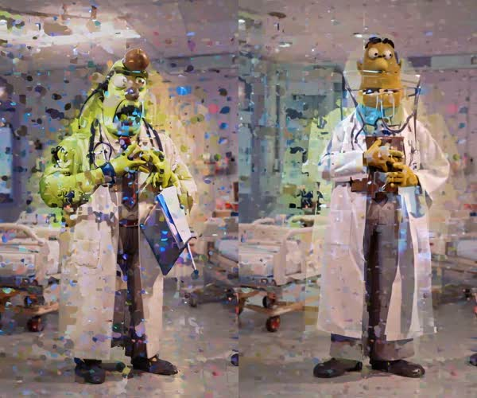

The soft style suffix does not rescue the avocado scene: same confetti, and
the character changed. For this scene the artefact is in the prompt + seed
itself; the fix is a plainer setting and several seeds, picked by score.
`scripts/speckle_score.py` (mean |Laplacian| per frame, lower = cleaner) now
ranks clips so the pick needs no eyes.

Correction, 17:10: the speckle score does **not** work. Ranking of the 12
references + A/B: rain (cherry, 14.8) and chandelier sparkle (pineapple, 12.9)
score as speckled, the avocado confetti scores clean (10.3). Global edge
density cannot tell scattered blobs from real detail. Picking references
stays visual for now; 12 scenes is a small enough roster. A better metric
would count small isolated saturated blobs, or use temporal incoherence.
Parked.

## 2026-09-01 17:05 (box time) — Skeleton-controlled generation works

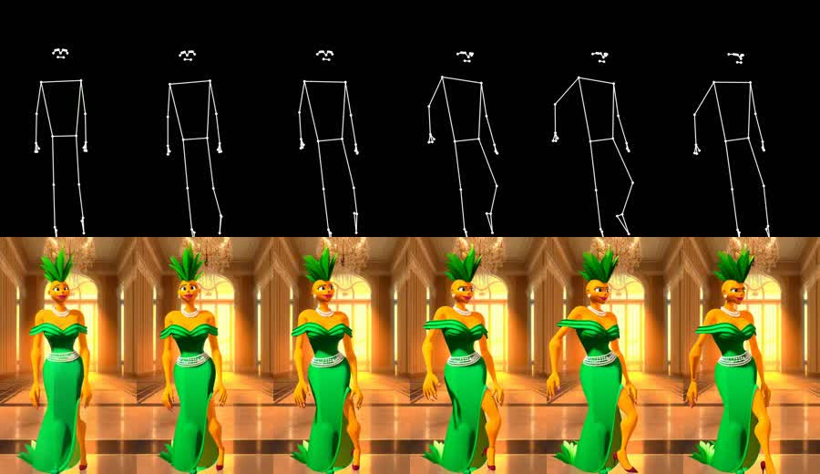

`pineapple_hallway__myrthe_000.mp4`: Wan 2.1 VACE 1.3B, control = our
MediaPipe-style skeleton video, reference = the pineapple scene's first
frame, 480×832, 81 frames, 30 steps, 4.3 min on the 4090.

- Pose re-detected on **81 of 81** output frames.
- Mean joint error between the driving skeleton and the re-detected skeleton:
  **0.026** of the frame (2.6 %). The character does what the human did.
- Identity held: gown, crown, pearls, hallway. VACE frames the character a
  little larger than the skeleton but the joints line up.
- Pairs from this clip need no detection: the landmarks that drove it are the
  conditioning. This is the exact-pairs data path from `STRATEGY.md`, proven.

Consequence: the human performance is the primary data source from here.
Twelve minutes of one person moving gives 160 control clips; each scene can
be animated along any of them. The 23 remaining VACE clips run until ~18:45,
then pairs and both trainings.

## 2026-09-01 18:45 (Mac time) — Tailscale key expired on the box

`tailscale ping codespace-4090` → "peer's node key has expired". SSH times
out. The box is up and the pipeline continues (VACE batch, then
`after_vace.sh`: pairs, pix2pix, pix2pixHD), but nothing can be observed or
synced until the node re-authenticates.

Fix, on the box (keyboard or LAN):
```
sudo tailscale up
```
and open the login URL it prints. To prevent a repeat: Tailscale admin
console → Machines → codespace-4090 → Disable key expiry.

A watcher on the Mac retries SSH every minute and resumes syncing and
reporting when the box is back. Expected on the box meanwhile: VACE done
~18:40, pairs ~18:50, pix2pix until ~20:00, pix2pixHD until ~21:30.

## 2026-09-02 10:10 (box time) — Overnight results and a corrected diagnosis

- VACE: 24/24 clips. Pairs: **8,067** from 92 clips. pix2pix: 25 epochs done.
  pix2pixHD: the box rebooted at 21:55 (third reboot that day) at epoch 8 of
  10; resumed from the epoch-6 snapshot this morning.


- The scene color works: each background color produces its scene. Characters
  are recognizable when the skeleton is complete.
- **Corrected diagnosis:** the confetti was the resolution. 768×1280 is off
  the Turbo model's 704×1280 distillation grid; off-grid sizes leave
  unconverged latent cells (RunPod test, see `SPEC_WAN.md`). My seed/prompt
  A/B only changed its visibility. All 68 scene clips from the 4090 carry it;
  RunPod regenerates everything at 704×1280. Rebuild pairs and retrain when
  those clips are in. VACE clips (480×832, native grid) are unaffected.
- Open: MediaPipe-style vs OpenPose-detector control for VACE. RunPod says
  MediaPipe is ignored; the 4090 measurement says 81/81 frames at 2.6 % joint
  error. One controlled comparison with the same driving clip decides it.

## 2026-09-02 11:45 (box time) — pix2pixHD in Figment: it runs, but headless Electron is on SwiftShader

- pix2pixHD scenes run finished (10 epochs, `media/train_scenes_hd/generator_epoch_10.onnx`).
- fp16 conversion (`scripts/convert_fp16.py`, fp32 I/O for the node's buffers):
  365 MB, PSNR 78 dB vs fp32 on the CPU provider. On WebGPU the plain fp16
  graph outputs uniform gray: InstanceNormalization overflows in fp16. A mixed
  build keeps InstanceNormalization in fp32 (`op_block_list`).
- Custom node `figment/onnxImageModelSync.js` (`project.onnxImageModelSync`,
  stored as source in the `.fgmt`): loads the model inside the frame and waits
  for each inference while exporting, so every rendered frame is a real
  inference. `scripts/make_figment_test.py` writes test projects with it.
- Figment headless (`Figment --render`) on the box: **the fp32 pix2pixHD and
  the U-Net render real frames** through the ONNX Image Model path. The mixed
  fp16 model fails with "Invalid ComputePipeline Cast": Figment's device is
  created without `shader-f16`. Proposed one-line fix:
  `figment/figment-shader-f16.patch`.
- The catch: the WebGPU adapter in that headless Electron is **SwiftShader**
  (software). U-Net ~17 s per frame, HD ~5 min per frame, GPU at 0 %. The
  NVIDIA Vulkan ICD is present; Chromium's GPU process fails in this session
  (`dri_gbm.so: Permission denied` under the sandbox). Figment's `--render`
  parser rejects every Chromium switch, so `--no-sandbox` / Vulkan flags
  cannot be passed on the command line.
- `figment/bench/` is a minimal Electron harness (same Chromium, same patched
  onnxruntime-web) that sets the switches programmatically. It reports the
  adapter and ms/frame per model; running now.
- Control clips are H.264 now (`make_control_clips.py` re-encodes with
  ffmpeg): Chromium cannot decode OpenCV's MPEG-4 part 2.

## 2026-09-02 12:05 (box time) — The real fps: HD at 20 fps on the 4090 in WebGPU

`figment/bench` (Electron 44 + Figment's onnxruntime-web 1.25, switches set in
the main process), 512×768, 30 timed frames after warm-up:

| model | adapter | ms/frame | fps | load |
| --- | --- | --- | --- | --- |
| U-Net fp32, default switches | google / swiftshader | 20,037 | 0.05 | — |
| U-Net fp32, ANGLE on Vulkan | nvidia / lovelace | 17.1 | **58.5** | 0.9 s |
| pix2pixHD fp32, ANGLE on Vulkan | nvidia / lovelace | 50.3 | **19.9** | 1.7 s |
| pix2pixHD fp16 (both builds) | nvidia / lovelace | session fails: device has no `shader-f16` | | |

- Switches that make the difference: `--use-angle=vulkan
  --enable-features=Vulkan,VulkanFromANGLE,DefaultANGLEVulkan`. `--no-sandbox`
  is not needed. Proposed Figment change: `figment/figment-linux-vulkan.patch`
  (Linux only, in `main.js`, since the `--render` parser rejects switches).
- Consequence for the 4090 PC as a Figment machine: without that patch every
  ML node there runs on SwiftShader.
- fp16 is optional now: HD fp32 already gives 20 fps. If wanted later, the
  device needs `shader-f16` (`figment/figment-shader-f16.patch`) and the
  mixed build (fp32 InstanceNormalization) avoids the gray-frame overflow.

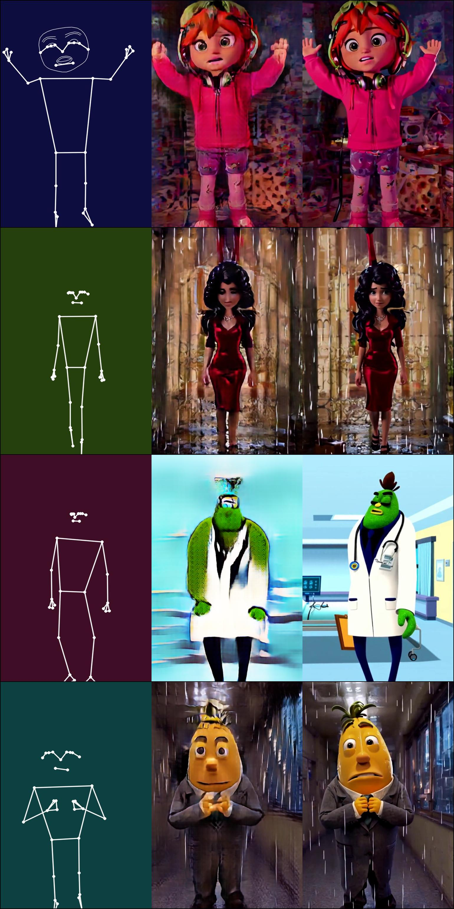

pix2pixHD, epoch 10, 8,067 pairs. Skeleton + scene color in, character out:
strawberry girl with headphones (arms up), cherry woman in the rain, avocado
doctor, lemon man in the corridor. This is the model to put in Figment:
`media/train_scenes_hd/generator_epoch_10.onnx`, 20 fps at 512×768.
